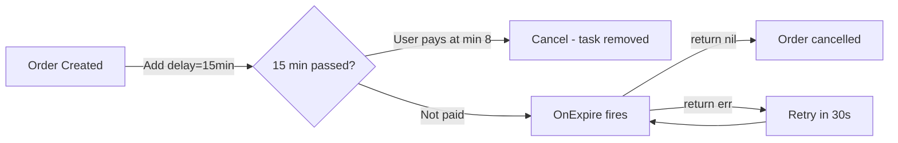
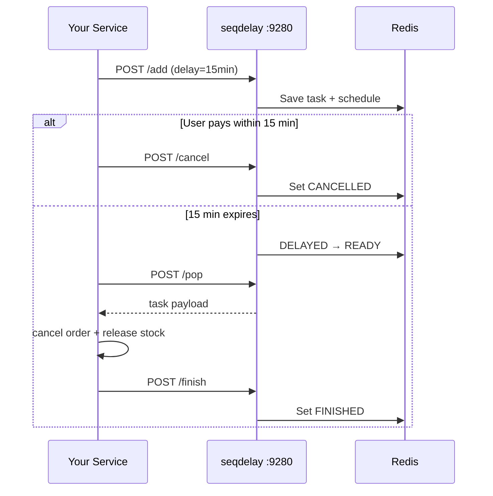
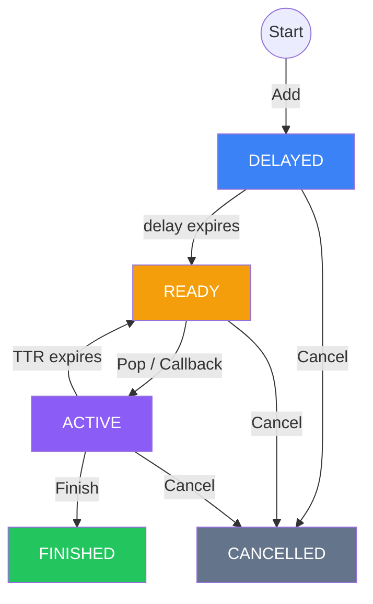
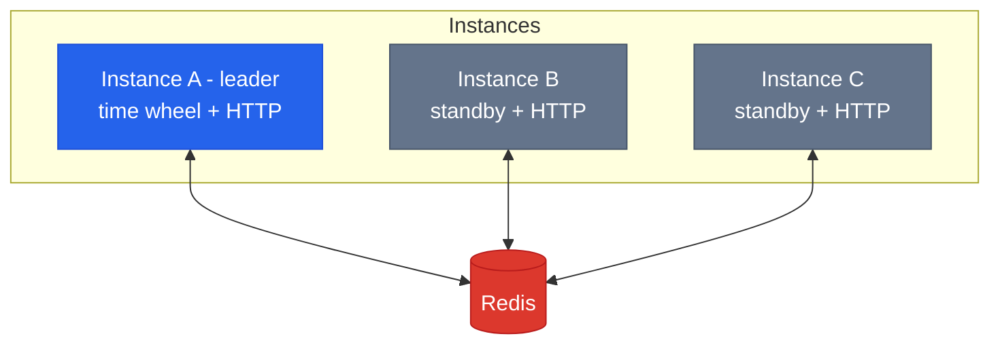

<p align="center">
  <b>seqdelay</b>
</p>

<p align="center">
  High-performance delay queue powered by <a href="https://github.com/gocronx/seqflow">seqflow</a> time wheel + Redis
</p>

<p align="center">
  
  
  
</p>

<p align="center">
  <a href="README_zh.md">中文</a>&nbsp;&nbsp;|&nbsp;&nbsp;<b>English</b>
</p>

---

## What is seqdelay

A delay queue that schedules tasks with configurable precision (default 1ms), backed by Redis for persistence and distributed coordination. Use it as an embedded Go library or a standalone HTTP service.

Built on [seqflow](https://github.com/gocronx/seqflow)'s time wheel — tasks are scheduled via O(1) slot insertion instead of Redis Sorted Set polling.

## Use Cases

- **Order auto-cancel** — unpaid after 15 minutes, auto close and release inventory
- **Order auto-review** — no review after 5 days, auto submit positive review
- **Membership reminder** — send SMS 15 days and 3 days before expiration
- **Payment callback retry** — Alipay/WeChat async notification with progressive intervals (2m, 10m, 1h, 6h...)
- **Coupon expiration** — notify user before coupon expires, then invalidate
- **Scheduled push** — marketing messages at a specific future time
- **Rate limit cooldown** — unlock user account after a temporary ban expires

## Install

```bash
go get github.com/gocronx/seqdelay
```

## Quick Start

### Embedded mode (callback)

seqdelay runs inside your Go process. The callback is your business logic — no network call, no serialization overhead.

```go
q, _ := seqdelay.New(seqdelay.WithRedis("localhost:6379"))

q.OnExpire("order-timeout", func(ctx context.Context, task *seqdelay.Task) error {
    fmt.Printf("order %s expired\n", task.ID)
    return nil // return nil → auto Finish; return error → redeliver after TTR
})

q.Start(ctx)

q.Add(ctx, &seqdelay.Task{
    ID:    "order-123",
    Topic: "order-timeout",
    Body:  []byte(`{"orderId":"123"}`),
    Delay: 15 * time.Minute,
    TTR:   30 * time.Second,
})
```

### HTTP mode (pull)

seqdelay runs as a standalone service. Any language can interact via HTTP.

```go
q, _ := seqdelay.New(seqdelay.WithRedis("localhost:6379"))
q.Start(ctx)

srv := seqdelay.NewServer(q, seqdelay.WithServerAddr(":9280"))
srv.ListenAndServe()
```

```bash
# Add task
curl -X POST localhost:9280/add \
  -d '{"topic":"notify","id":"msg-1","delay_ms":5000,"ttr_ms":30000}'

# Pop ready task (long-poll, waits up to 30s)
curl -X POST localhost:9280/pop -d '{"topic":"notify"}'

# Finish
curl -X POST localhost:9280/finish -d '{"topic":"notify","id":"msg-1"}'
```

## Real-World Example: Auto-Cancel Unpaid Orders After 15 Minutes

Order created → if user doesn't pay within 15 minutes → auto cancel and release inventory.

### Approach 1: Embedded (Go service)

Best when your service is written in Go. Direct function call, lowest latency.

```go
// === In your order service ===

// On startup: register callback
q.OnExpire("order-auto-cancel", func(ctx context.Context, task *seqdelay.Task) error {
    var data struct{ OrderID string `json:"order_id"` }
    json.Unmarshal(task.Body, &data)

    if isOrderPaid(data.OrderID) {
        return nil // already paid, skip
    }
    return cancelOrderAndReleaseStock(data.OrderID)
})

// On order created: schedule auto-cancel
q.Add(ctx, &seqdelay.Task{
    ID:    "cancel-" + orderID,
    Topic: "order-auto-cancel",
    Body:  []byte(`{"order_id":"` + orderID + `"}`),
    Delay: 15 * time.Minute,    // 15 minutes
    TTR:   30 * time.Second,    // retry after 30s on failure
})

// User pays: cancel the auto-cancel task
q.Cancel(ctx, "order-auto-cancel", "cancel-" + orderID)
```



### Approach 2: HTTP (any language)

Best when your service is not Go, or seqdelay runs as a shared service for multiple teams.



**Your service (any language):**

```python
# On order created
requests.post("http://seqdelay:9280/add", json={
    "topic": "order-auto-cancel",
    "id": f"cancel-{order_id}",
    "body": json.dumps({"order_id": order_id}),
    "delay_ms": 15 * 60 * 1000,  # 15 minutes in ms
    "ttr_ms": 30000
})

# User pays successfully
requests.post("http://seqdelay:9280/cancel", json={
    "topic": "order-auto-cancel",
    "id": f"cancel-{order_id}"
})
```

**Worker (runs alongside your service):**

```python
while True:
    resp = requests.post("http://seqdelay:9280/pop", json={
        "topic": "order-auto-cancel",
        "timeout_ms": 30000  # long-poll 30s
    })
    if resp.json()["data"]:
        task = resp.json()["data"]
        cancel_order(task["body"])
        requests.post("http://seqdelay:9280/finish", json={
            "topic": "order-auto-cancel",
            "id": task["id"]
        })
```

## API

### Go SDK

| Method | Description |
|--------|-------------|
| `Add(ctx, *Task)` | Add a delayed task |
| `Pop(ctx, topic)` | Pull a ready task (blocking) |
| `Finish(ctx, topic, id)` | Mark task complete |
| `Cancel(ctx, topic, id)` | Cancel a pending task |
| `Get(ctx, topic, id)` | Query task state |
| `OnExpire(topic, fn)` | Register callback (embedded mode) |
| `Shutdown(ctx)` | Graceful shutdown |

### HTTP Endpoints

| Endpoint | Method | Description |
|----------|--------|-------------|
| `/add` | POST | Add delayed task |
| `/pop` | POST | Pull ready task (long-poll) |
| `/finish` | POST | Ack completion |
| `/cancel` | POST | Cancel task |
| `/get` | GET | Query task |
| `/stats` | GET | Queue statistics |

## Task Lifecycle



## Examples

| Example | Description |
|---------|-------------|
| [embedded](example/embedded) | Callback mode inside your Go process |
| [httpserver](example/httpserver) | Standalone HTTP service with curl usage |
| [distributed](example/distributed) | Multi-instance with leader election |
| [ttr-retry](example/ttr-retry) | TTR timeout and automatic redelivery |
| [batch-add](example/batch-add) | Add 1000 tasks with varying delays |
| [cancel](example/cancel) | Cancel a task before it fires |
| [stats-monitor](example/stats-monitor) | Monitor queue stats via HTTP `/stats` |

## Configuration

| Option | Default | Description |
|--------|---------|-------------|
| `WithRedis(addr)` | required | Redis standalone |
| `WithRedisSentinel(addrs, master)` | — | Redis Sentinel |
| `WithRedisCluster(addrs)` | — | Redis Cluster |
| `WithTickInterval(d)` | 1ms | Time wheel precision |
| `WithWheelCapacity(n)` | 4096 | Wheel slot count (power of 2) |
| `WithMaxTopics(n)` | 1024 | Max topic count |
| `WithPopTimeout(d)` | 30s | Default HTTP pop timeout |
| `WithLockTTL(d)` | 500ms | Distributed lock TTL |
| `WithInstanceID(id)` | auto | Instance ID for distributed lock |

## Distributed Deployment

Multiple instances against the same Redis. Only one advances the time wheel (leader). All serve HTTP.



Leader crash → lock expires (500ms) → standby takes over automatically.

## Performance

```
Apple M4 / arm64

Time wheel (pure scheduling, no Redis):
  1M Add:           225ms (4.4M tasks/sec)
  1M Add + Fire:    1.2s (all 1M fired, zero loss)
  4 writers × 250K: 187ms (5.3M tasks/sec)
  1M Cancel:        268ms (290 ns/op)
```

## Design

- **seqflow time wheel** — O(1) add/fire, replaces Redis Sorted Set polling
- **Redis Lua scripts** — atomic state transitions, no race conditions
- **{topic} hash tag** — all keys for a topic on same Redis Cluster slot
- **Distributed lock** — SetNX + heartbeat renewal for multi-instance
- **Recovery** — full task recovery from Redis on restart
