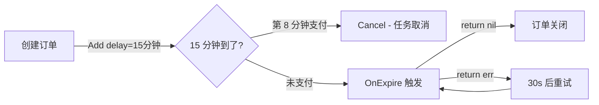
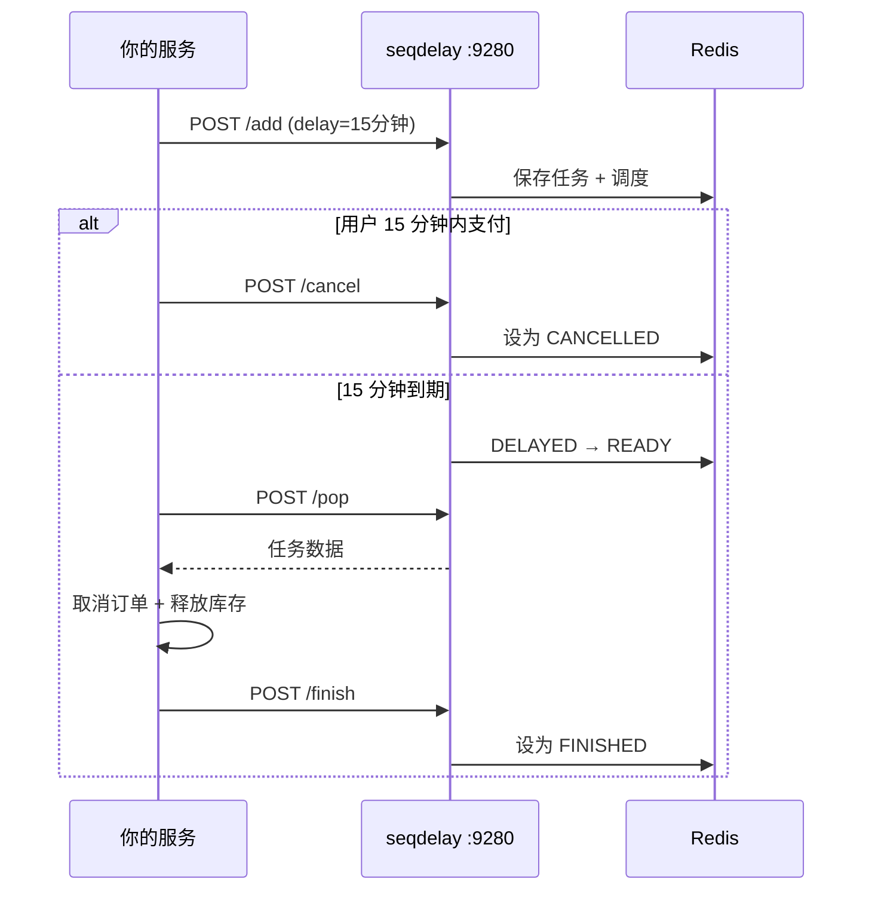
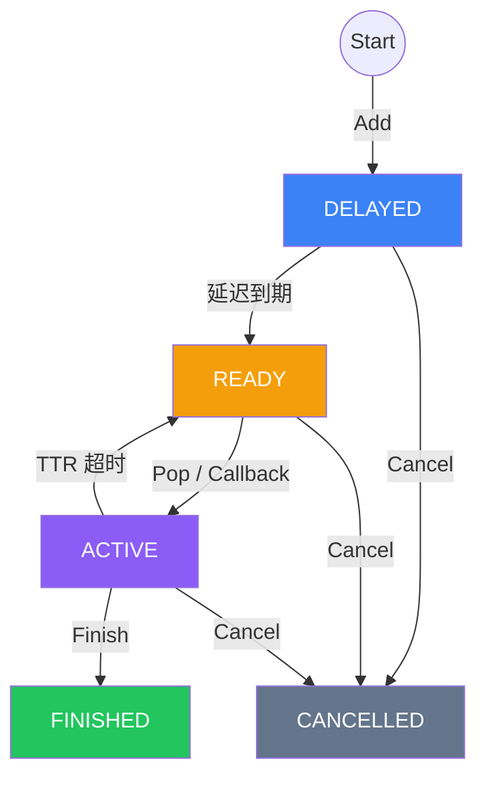
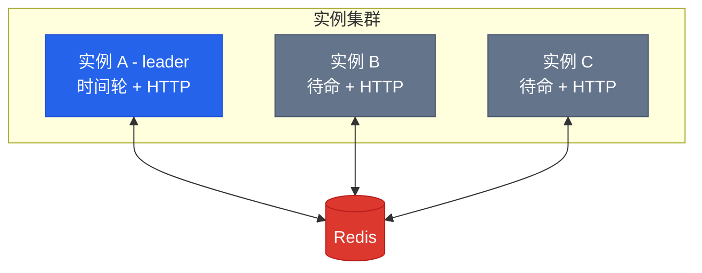

<p align="center">
  <b>seqdelay</b>
</p>

<p align="center">
  基于 <a href="https://github.com/gocronx/seqflow">seqflow</a> 时间轮 + Redis 的高性能延迟队列
</p>

<p align="center">
  
  
  
</p>

<p align="center">
  <b>中文</b>&nbsp;&nbsp;|&nbsp;&nbsp;<a href="README.md">English</a>
</p>

---

## 什么是 seqdelay

一个可配置精度（默认 1ms）的延迟队列，使用 Redis 持久化和分布式协调。可以作为 Go 库嵌入使用，也可以独立部署为 HTTP 服务。

基于 [seqflow](https://github.com/gocronx/seqflow) 时间轮 — 任务调度 O(1) 槽位插入，替代 Redis Sorted Set 轮询。

## 应用场景

- **订单自动取消** — 超过 15 分钟未支付，自动关闭并释放库存
- **订单自动好评** — 完成后用户 5 天未评价，自动提交好评
- **会员到期提醒** — 到期前 15 天、3 天分别发送短信提醒
- **支付回调重试** — 支付宝/微信异步通知，递增间隔重试（2m, 10m, 1h, 6h...）
- **优惠券过期** — 过期前通知用户，到期后自动失效
- **定时推送** — 运营消息在指定时间发送
- **限流冷却** — 用户临时封禁到期后自动解封

## 安装

```bash
go get github.com/gocronx/seqdelay
```

## 快速开始

### 嵌入模式（callback）

seqdelay 运行在你的 Go 进程内，回调就是你的业务代码 — 无网络调用，无序列化开销。

```go
q, _ := seqdelay.New(seqdelay.WithRedis("localhost:6379"))

q.OnExpire("order-timeout", func(ctx context.Context, task *seqdelay.Task) error {
    fmt.Printf("订单 %s 超时\n", task.ID)
    return nil // return nil → 自动 Finish；return error → TTR 后重投
})

q.Start(ctx)

q.Add(ctx, &seqdelay.Task{
    ID:    "order-123",
    Topic: "order-timeout",
    Body:  []byte(`{"orderId":"123"}`),
    Delay: 15 * time.Minute,
    TTR:   30 * time.Second,
})
```

### HTTP 模式（pull）

seqdelay 作为独立服务运行，任何语言都可以通过 HTTP 交互。

```go
q, _ := seqdelay.New(seqdelay.WithRedis("localhost:6379"))
q.Start(ctx)

srv := seqdelay.NewServer(q, seqdelay.WithServerAddr(":9280"))
srv.ListenAndServe()
```

```bash
# 添加任务
curl -X POST localhost:9280/add \
  -d '{"topic":"notify","id":"msg-1","delay_ms":5000,"ttr_ms":30000}'

# 拉取就绪任务（长轮询，最多等 30s）
curl -X POST localhost:9280/pop -d '{"topic":"notify"}'

# 完成
curl -X POST localhost:9280/finish -d '{"topic":"notify","id":"msg-1"}'
```

## 实际场景：15 分钟未支付自动取消订单

下单 → 15 分钟内未支付 → 自动取消订单并释放库存。

### 方式 1：嵌入模式（Go 服务）

适合 Go 项目，直接函数调用，延迟最低。

```go
// === 在你的订单服务中 ===

// 启动时注册回调
q.OnExpire("order-auto-cancel", func(ctx context.Context, task *seqdelay.Task) error {
    var data struct{ OrderID string `json:"order_id"` }
    json.Unmarshal(task.Body, &data)

    if isOrderPaid(data.OrderID) {
        return nil // 已支付，跳过
    }
    return cancelOrderAndReleaseStock(data.OrderID)
})

// 创建订单时：投递延迟任务
q.Add(ctx, &seqdelay.Task{
    ID:    "cancel-" + orderID,
    Topic: "order-auto-cancel",
    Body:  []byte(`{"order_id":"` + orderID + `"}`),
    Delay: 15 * time.Minute,    // 15 分钟
    TTR:   30 * time.Second,    // 失败后 30s 重试
})

// 用户支付成功后：取消自动取消任务
q.Cancel(ctx, "order-auto-cancel", "cancel-" + orderID)
```



### 方式 2：HTTP 模式（任何语言）

适合非 Go 服务，或者 seqdelay 作为公共服务给多个团队使用。



**你的服务（任何语言）：**

```python
# 创建订单时
requests.post("http://seqdelay:9280/add", json={
    "topic": "order-auto-cancel",
    "id": f"cancel-{order_id}",
    "body": json.dumps({"order_id": order_id}),
    "delay_ms": 15 * 60 * 1000,  # 15 分钟，毫秒
    "ttr_ms": 30000
})

# 用户支付成功后
requests.post("http://seqdelay:9280/cancel", json={
    "topic": "order-auto-cancel",
    "id": f"cancel-{order_id}"
})
```

**Worker（和你的服务一起运行）：**

```python
while True:
    resp = requests.post("http://seqdelay:9280/pop", json={
        "topic": "order-auto-cancel",
        "timeout_ms": 30000  # 长轮询 30s
    })
    if resp.json()["data"]:
        task = resp.json()["data"]
        cancel_order(task["body"])
        requests.post("http://seqdelay:9280/finish", json={
            "topic": "order-auto-cancel",
            "id": task["id"]
        })
```

## API

### Go SDK

| 方法 | 说明 |
|------|------|
| `Add(ctx, *Task)` | 添加延迟任务 |
| `Pop(ctx, topic)` | 拉取就绪任务（阻塞） |
| `Finish(ctx, topic, id)` | 确认完成 |
| `Cancel(ctx, topic, id)` | 取消任务 |
| `Get(ctx, topic, id)` | 查询任务状态 |
| `OnExpire(topic, fn)` | 注册回调（嵌入模式） |
| `Shutdown(ctx)` | 优雅关闭 |

### HTTP 端点

| 端点 | 方法 | 说明 |
|------|------|------|
| `/add` | POST | 添加延迟任务 |
| `/pop` | POST | 拉取就绪任务（长轮询） |
| `/finish` | POST | 确认完成 |
| `/cancel` | POST | 取消任务 |
| `/get` | GET | 查询任务 |
| `/stats` | GET | 队列统计 |

## 任务生命周期



## 示例

| 示例 | 说明 |
|------|------|
| [embedded](example/embedded) | 嵌入模式 + callback |
| [httpserver](example/httpserver) | 独立 HTTP 服务 |
| [distributed](example/distributed) | 多实例 + leader 选举 |
| [ttr-retry](example/ttr-retry) | TTR 超时自动重试 |
| [batch-add](example/batch-add) | 批量添加 1000 个任务 |
| [cancel](example/cancel) | 取消未触发的任务 |
| [stats-monitor](example/stats-monitor) | HTTP /stats 监控 |

## 配置

| 选项 | 默认值 | 说明 |
|------|--------|------|
| `WithRedis(addr)` | 必填 | Redis 单机 |
| `WithRedisSentinel(addrs, master)` | — | Redis Sentinel |
| `WithRedisCluster(addrs)` | — | Redis Cluster |
| `WithTickInterval(d)` | 1ms | 时间轮精度 |
| `WithWheelCapacity(n)` | 4096 | 时间轮容量（2 的幂） |
| `WithMaxTopics(n)` | 1024 | 最大 topic 数 |
| `WithPopTimeout(d)` | 30s | HTTP Pop 默认超时 |
| `WithLockTTL(d)` | 500ms | 分布式锁 TTL |
| `WithInstanceID(id)` | 自动 | 实例 ID（分布式锁用） |

## 分布式部署

多个实例连接同一个 Redis，只有一个推进时间轮（leader），所有实例都可以处理 HTTP 请求。



Leader 宕机 → 锁 500ms 过期 → standby 自动接管。

## 性能

```
Apple M4 / arm64

时间轮（纯调度，无 Redis）：
  100万 插入：           225ms（440万 tasks/sec）
  100万 插入+触发：      1.2s（全部触发，零丢失）
  4 并发写 × 25万：      187ms（530万 tasks/sec）
  100万 取消：           268ms（290 ns/op）
```

## 设计要点

- **seqflow 时间轮** — O(1) 添加/触发，替代 Redis Sorted Set 轮询
- **Redis Lua 脚本** — 原子状态转换，无竞态条件
- **{topic} hash tag** — 同 topic 所有 key 落同一个 Cluster slot
- **分布式锁** — SetNX + 心跳续期，支持多实例
- **崩溃恢复** — 重启后从 Redis 完整恢复所有任务
