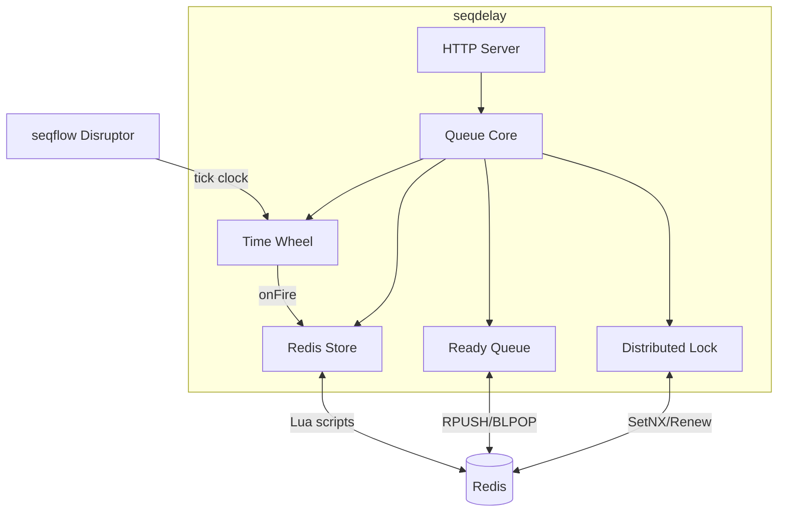

# Design

## Architecture



## Time Wheel Engine

seqflow's Disruptor drives the tick clock. The wheel slots are a separate array exclusively owned by the handler goroutine.

```
seqflow Disruptor          Time Wheel Slots
(RingBuffer[int64])        (separate array)
Reserve(1) → Commit  ──→  slots[cursor & mask]
                           process entries
                           fire expired tasks
```

Key invariant: only the handler goroutine reads/writes the slot array. `Add()` sends commands through a buffered channel. No locks on the wheel.

## Lua Scripts

Four atomic scripts for state transitions:

| Script | Operation | Keys |
|--------|-----------|------|
| add.lua | Duplicate check + SET + SADD | task key, index key |
| finish.lua | CAS state check + SET + SREM | task key, index key |
| ready.lua | State transition + RPUSH | task key, ready key |
| cancel.lua | SET cancelled + SREM | task key, index key |

All scripts use optimistic CAS: Go reads, validates, re-encodes, Lua compares-and-swaps.

## Ready Queue

Two backends depending on mode:

- **Embedded (callback):** background goroutine BLPOPs from Redis list, dispatches to callback function
- **HTTP (pull):** Pop handler BLPOPs from Redis list directly

Redis List is the source of truth in both modes. Crash-safe: on restart, recovery re-pushes READY tasks.
