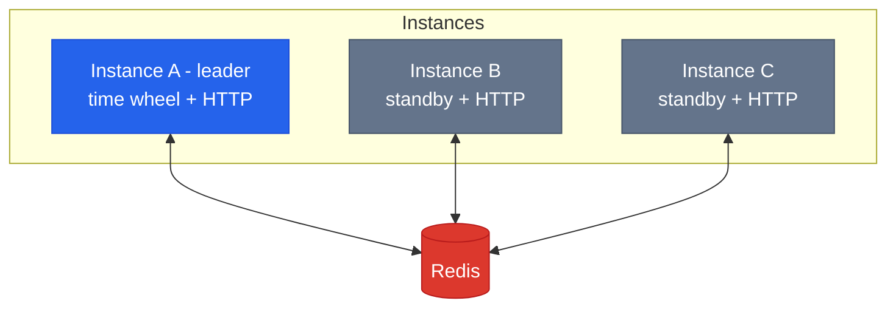

# Distributed Deployment

## Architecture

Multiple seqdelay instances connect to the same Redis. Only one (the leader) advances the time wheel. All instances serve HTTP requests.



## Leader Election

Uses Redis distributed lock (`seqdelay:lock:tick`) with heartbeat renewal:

1. Each instance tries `SET lock instanceID NX PX 500` every ~170ms
2. Winner becomes leader, starts advancing the time wheel
3. Leader renews lock after each tick batch (heartbeat)
4. If leader crashes, lock expires in 500ms
5. Another instance acquires the lock and becomes the new leader

## What Each Instance Does

| Operation | Leader | Standby |
|-----------|--------|---------|
| Time wheel tick | Yes | No |
| Fire expired tasks | Yes | No |
| POST /add | Yes | Yes |
| POST /pop | Yes | Yes |
| POST /finish | Yes | Yes |
| Recovery on start | Yes | Yes |

## Redis Modes

```go
// Standalone
seqdelay.WithRedis("localhost:6379")

// Sentinel (high availability)
seqdelay.WithRedisSentinel(
    []string{"sentinel1:26379", "sentinel2:26379"},
    "mymaster",
)

// Cluster (horizontal scaling)
seqdelay.WithRedisCluster(
    []string{"node1:6379", "node2:6379", "node3:6379"},
)
```

### Cluster Compatibility

All Redis keys use `{topic}` hash tag:

```
seqdelay:{orders}:task:123
seqdelay:{orders}:ready
seqdelay:{orders}:index
```

Same-topic keys always land on the same hash slot. Lua scripts never cross slots.

## Recovery

On startup, each instance recovers all tasks from Redis:

1. Read `seqdelay:{topic}:index` for each topic
2. For each task, check state and recalculate remaining delay
3. Re-inject into time wheel or push to ready list

Recovery is idempotent. Multiple instances recovering simultaneously is safe.
