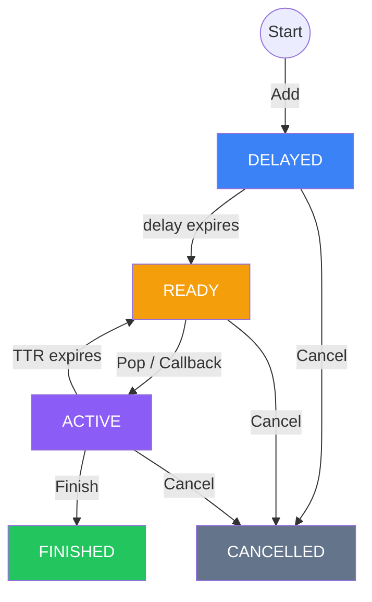

# Task Lifecycle

## State Machine



## States

| State | Description |
|-------|-------------|
| **DELAYED** | Waiting in time wheel. Not yet visible to consumers. |
| **READY** | In the Redis ready list. Available for Pop or Callback. |
| **ACTIVE** | Popped by a consumer. TTR countdown has started. |
| **FINISHED** | Completed. Kept in Redis for 60s for observability, then auto-deleted. |
| **CANCELLED** | Cancelled by user. Kept in Redis for 60s, then auto-deleted. |

## TTR (Time-To-Run)

After a task is popped, it has `TTR` seconds to be Finished. If the consumer fails to call Finish:

1. TTR timer fires in the time wheel
2. Task state reverts from ACTIVE to READY
3. Task is re-pushed to the ready list
4. `Retries` counter increments
5. If `MaxRetries > 0` and `Retries >= MaxRetries`, task moves to FINISHED (exhausted)

## Atomicity

All state transitions use Redis Lua scripts. This guarantees:

- No partial updates (save + index update is atomic)
- No race between Finish and TTR expiry (optimistic CAS pattern)
- No duplicate delivery from concurrent Pop

## Redis Keys

All keys use `{topic}` hash tag for Redis Cluster compatibility:

```
seqdelay:{topic}:task:{id}   -- task metadata (msgpack)
seqdelay:{topic}:ready       -- ready list (Redis List)
seqdelay:{topic}:index       -- active task IDs (Redis Set)
```
