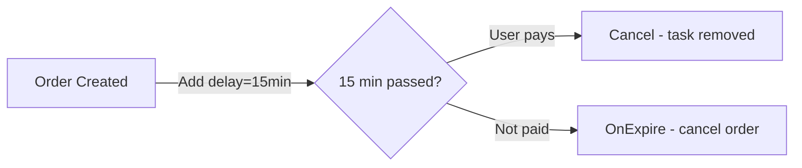

# Use Cases

## Order Auto-Cancel

Unpaid after 15 minutes, auto close and release inventory.

```go
// Order created → schedule auto-cancel
q.Add(ctx, &seqdelay.Task{
    ID:    "cancel-" + orderID,
    Topic: "order-auto-cancel",
    Delay: 15 * time.Minute,
    TTR:   30 * time.Second,
})

// User pays → cancel the task
q.Cancel(ctx, "order-auto-cancel", "cancel-" + orderID)
```



## Payment Callback Retry

Alipay/WeChat async notification with progressive intervals.

```go
intervals := []time.Duration{0, 2*time.Minute, 10*time.Minute, 1*time.Hour, 6*time.Hour}

q.OnExpire("payment-notify", func(ctx context.Context, task *seqdelay.Task) error {
    err := sendNotification(task.Body)
    if err != nil {
        return err // TTR will handle retry with next interval
    }
    return nil
})
```

## Membership Reminder

Send SMS 15 days and 3 days before expiration.

```go
q.Add(ctx, &seqdelay.Task{
    ID: "remind-15d-" + userID, Topic: "membership-remind",
    Delay: expiresAt.Add(-15 * 24 * time.Hour).Sub(time.Now()),
})

q.Add(ctx, &seqdelay.Task{
    ID: "remind-3d-" + userID, Topic: "membership-remind",
    Delay: expiresAt.Add(-3 * 24 * time.Hour).Sub(time.Now()),
})
```

## More Scenarios

- **Coupon expiration** — notify before expiry, then invalidate
- **Scheduled push** — marketing messages at a specific future time
- **Rate limit cooldown** — unlock account after temporary ban expires
- **Auto-review** — default positive review after 5 days without user action
