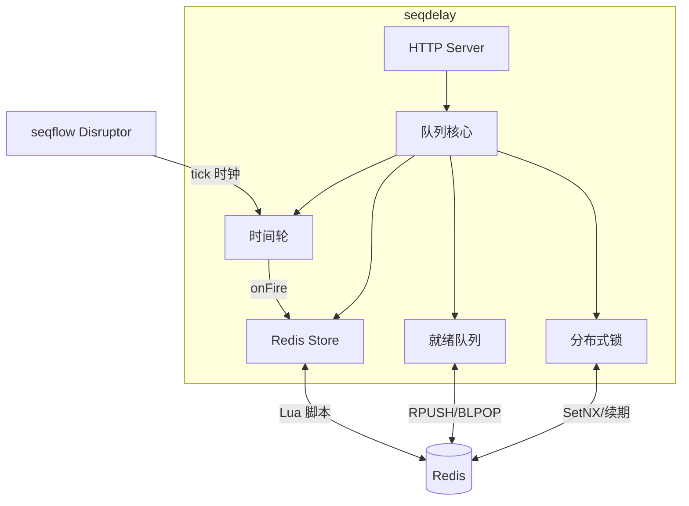

# 设计

## 架构

## 时间轮

seqflow Disruptor 驱动 tick 时钟，轮盘槽位是独立数组，由 handler goroutine 独占。

## Lua 脚本

4 个原子脚本：add、finish、ready、cancel。乐观 CAS 模式。

## 就绪队列

Redis List 为持久化数据源。嵌入模式额外有 drain goroutine 拉取到本地 channel。
