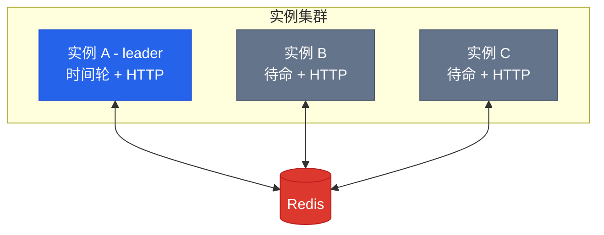

# 分布式部署

多个实例连接同一个 Redis，只有一个推进时间轮（leader），所有实例都可以处理 HTTP 请求。



Leader 宕机 → 锁 500ms 过期 → standby 自动接管。

## Redis 模式

```go
seqdelay.WithRedis("localhost:6379")                         // 单机
seqdelay.WithRedisSentinel(addrs, "mymaster")                // Sentinel
seqdelay.WithRedisCluster([]string{"n1:6379", "n2:6379"})    // Cluster
```
