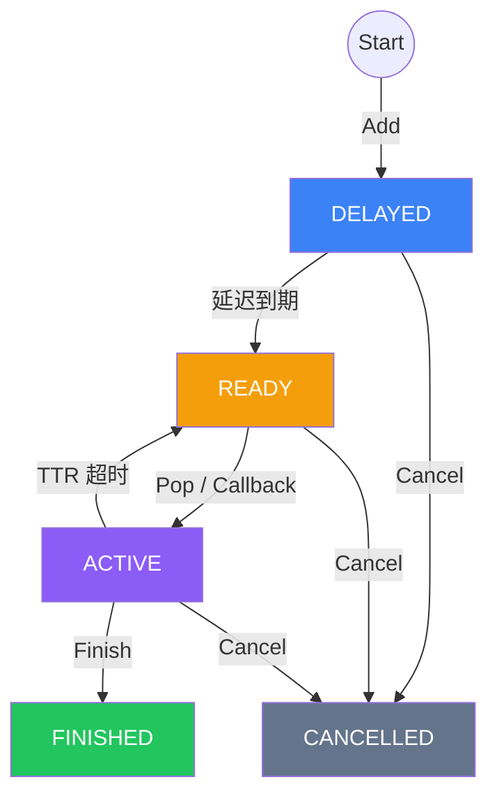

# 任务生命周期

## 状态说明

| 状态 | 说明 |
|------|------|
| **DELAYED** | 在时间轮中等待 |
| **READY** | 在 Redis 就绪列表中，等待消费 |
| **ACTIVE** | 已被消费，TTR 倒计时中 |
| **FINISHED** | 已完成，保留 60s 后自动删除 |
| **CANCELLED** | 已取消，保留 60s 后自动删除 |

## TTR（Time-To-Run）

任务被 Pop 后有 TTR 秒完成。未 Finish 则自动重投。
