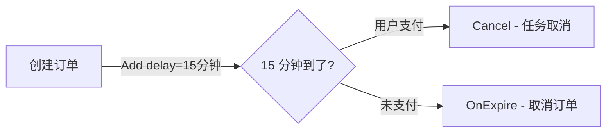

# 应用场景

## 订单自动取消

15 分钟未支付，自动关闭并释放库存。

```go
q.Add(ctx, &seqdelay.Task{
    ID:    "cancel-" + orderID,
    Topic: "order-auto-cancel",
    Delay: 15 * time.Minute,
    TTR:   30 * time.Second,
})

// 用户支付后取消
q.Cancel(ctx, "order-auto-cancel", "cancel-" + orderID)
```



## 更多场景

- **支付回调重试** — 递增间隔（2m, 10m, 1h, 6h...）
- **会员到期提醒** — 到期前 15 天、3 天发送提醒
- **优惠券过期** — 到期前通知，到期后失效
- **定时推送** — 运营消息定时发送
- **限流冷却** — 临时封禁到期后自动解封
